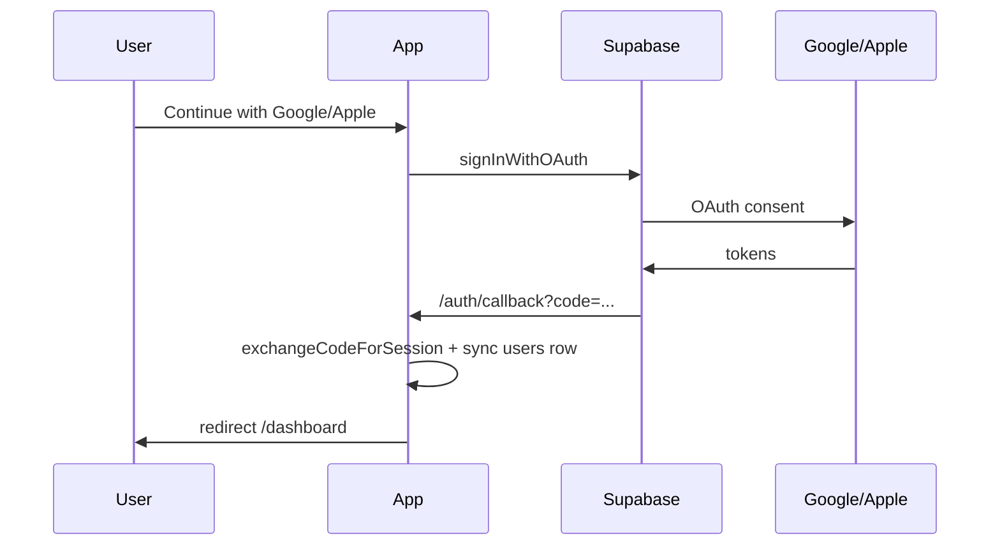

# Google & Apple OAuth setup

The app uses Supabase Auth with `signInWithOAuth` and `/auth/callback`. Configure providers in Supabase, then test from `/login`.

## Flow



## Google

1. [Google Cloud Console](https://console.cloud.google.com/) → your project → **APIs & Services** → **Credentials**.
2. **Create credentials** → **OAuth client ID** → **Web application**.
3. **Authorized JavaScript origins** (add each environment you use):
   - `http://localhost:3000`
   - `https://YOUR-PROJECT-REF.supabase.co`
   - Your Cloudflare tunnel URL if testing on a phone
4. **Authorized redirect URIs** (required — Supabase only):
   ```
   https://YOUR-PROJECT-REF.supabase.co/auth/v1/callback
   ```
   Find `YOUR-PROJECT-REF` in Supabase → **Project Settings** → **API**.
5. Supabase → **Authentication** → **Providers** → **Google** → Enable, paste Client ID & Secret.

## Apple

**New to Apple Developer?** Use the full walkthrough: **[apple-developer-setup.md](./apple-developer-setup.md)**

Summary:

1. Join **Apple Developer Program** ($99/year) at [developer.apple.com/programs](https://developer.apple.com/programs/).
2. Create **App ID** → enable Sign in with Apple.
3. Create **Services ID** → configure domain `YOUR-PROJECT-REF.supabase.co` and return URL `https://YOUR-PROJECT-REF.supabase.co/auth/v1/callback`.
4. Create **Key** → download `.p8`, note **Key ID**.
5. Copy **Team ID** from membership page.
6. Supabase → **Authentication** → **Providers** → **Apple** → paste Services ID, Team ID, Key ID, and `.p8` contents.

Apple only returns the user’s name on the **first** sign-in; it is stored in `user_metadata` and synced to `users.full_name`.

## Supabase redirect URLs (your app)

**Authentication** → **URL Configuration**:

| Setting | Example |
|---------|---------|
| Site URL | `http://localhost:3000` or tunnel URL |
| Redirect URLs | `http://localhost:3000/auth/callback` |
| | `http://localhost:3000/**` |
| | `https://xxxx.trycloudflare.com/auth/callback` |

The app builds `redirectTo` as `{origin}/auth/callback?next=/dashboard`. On mobile tunnel tests, open the app via the tunnel URL so `window.location.origin` matches Supabase allow list.

## Environment

```env
NEXT_PUBLIC_SUPABASE_URL=https://xxxx.supabase.co
NEXT_PUBLIC_SUPABASE_ANON_KEY=eyJ...
NEXT_PUBLIC_SITE_URL=http://localhost:3000
DATABASE_URL=postgresql://...
```

`DATABASE_URL` is required so `/auth/callback` can upsert the `users` table after OAuth.

## Troubleshooting

| Symptom | Fix |
|---------|-----|
| Redirect URI mismatch | Google/Apple redirect must be Supabase `.../auth/v1/callback`, not your app URL |
| Returns to login `oauth_failed` | Provider disabled or wrong client ID/secret in Supabase |
| Returns to login `missing_email` | Apple: request `email` scope; user may need to revoke app in Apple ID settings and sign in again |
| Works on desktop, not phone | Use tunnel URL in Supabase redirect list; open app via tunnel, not `localhost` |
| User not in `users` table | Check `DATABASE_URL`; see server logs for `[auth/callback] syncUserFromAuth` |

## Code references

- Client OAuth: `lib/auth/oauth.ts`
- Callback + session: `app/auth/callback/route.ts`
- DB sync: `lib/auth/sync-user.ts`
